# 2420-assignment-2

# Creating New User

To create a new user you'll be using the create-user file. **This file must be run with sudo or as root.** 
There are several flags you may use to customize the process.
#### Command Flags
    -a <username>    **REQUIRED**
    -b <password>
    -c <shell>     *Will default to /bin/bash if not set
    -d <groups>    *Must be comma separated values with no spaces

**Example:** Creating a user with the username "testuser", password "testpassword", shell "/bin/zsh", and added to the groups "testgroup1" and "testgroup2".

```
sudo ./create-user -a testuser -b testpassword -c /bin/zsh -d testgroup1,testgroup2
```

#


# create-install
* 
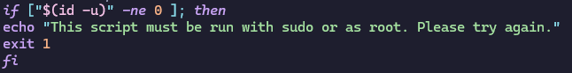
1. Ensure script is run with sudo or by root. Check if id of user running script is not equal to 0. If so, this indicates the script was not run with sudo or by the root user, so we return an error message and exit the script.

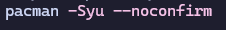
2. Sync, refresh, and update current packages. Using --noconfirm so that user does not need to enter input to confirm installation.

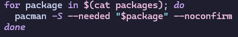
3. Iterate through packages file and install each package name listed. Using --needed so that it only installs if it isn't already installed. No user confirmation required.

# create-links

1. Ensure script is run with sudo or by root. Check if id of user running script is not equal to 0. If so, this indicates the script was not run with sudo or by the root user, so we return an error message and exit the script.

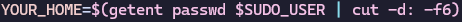
2. $SUDO_USER is a variable set by sudo containing the user that used the sudo command. We can match this user in /etc/passwd with getent and then cut the user's home directory to set it to a variable.

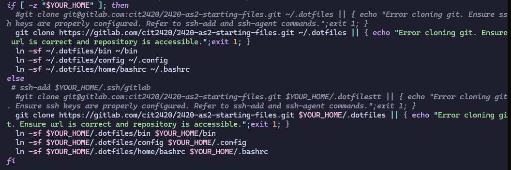
3. If the sudo user variable is empty we can assume the script was run as root and we configure directories appropriately using ~/ (could also use /root)
4. If the sudo user variable is NOT empty we can assume the script was run with sudo and we configure directories appropriately using the variable we created in step 1.
5. We force delete any existing .dotfiles directory and any files/folders within it so that our clone can procede.
6. We clone the git repository into desired location, if the command fails we give the user an error message asking them to check specific git issues.
7. We force create the desired symbolic links, overwriting any current files of the same name. 

# create-main
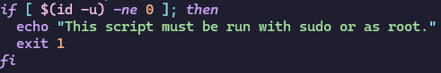
1. Ensure script is run with sudo or by root. Check if id of user running script is not equal to 0. If so, this indicates the script was not run with sudo or by the root user, so we return an error message and exit the script.

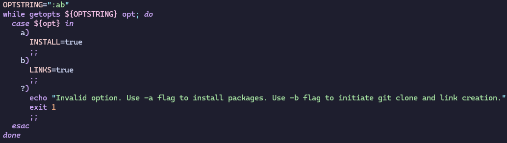
2. We use getopts to allow the person runing the script to specify whether they want to run the installation script, the clone and link creation script, or both. The -a flag sets INSTALL variable to true, -b flag sets LINKS variable to true, any other flag returns an error message to the user and exits the script.

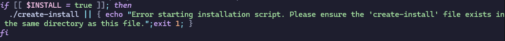
3. If installation variable has been set to true we run create-install script. If this command fails we return an error message asking user to ensure the required script exists in the necessary directory and then exits the script.


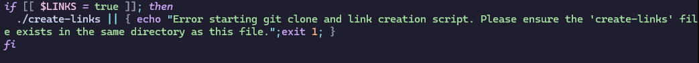
4. If links variable has been set to true we run create-links script. If this command fials we return an error message asking user to ensure the required script exists in the necessary directory and then exits the script.

# create-user

1. Ensure script is run with sudo or by root. Check if id of user running script is not equal to 0. If so, this indicates the script was not run with sudo or by the root user, so we return an error message and exit the script.

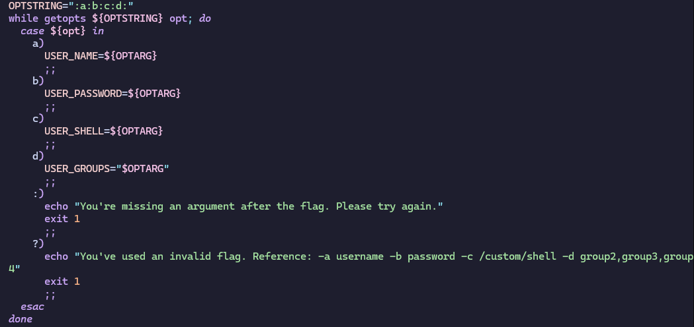
2. We use getopts to allow the person running the script to specify the username (-a flag), password (-b flag), custom shell (-c flag), and groups (-d flag) for the new user. 
* Each flag requires an argument and the script will return an error and exit the script if an argument is missing. 
* If any incorrect flags are used the script will return an error message and exit the script.  

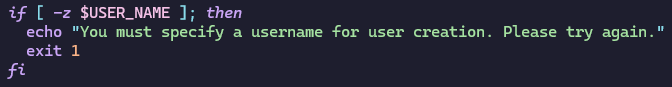
3. If the username has not been set the script will return an error informing the user that it's required and exit the script.


4. Assigning all existing users to a variable by cutting the correct segment of /etc/passwd file.

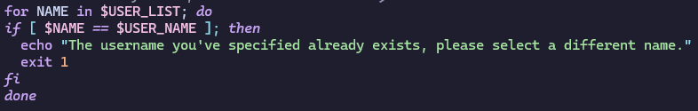
5. we iterate over the existing users to check if the desired username has already been taken. If it has, we return an error and exit the script. If the username is available, we continue.

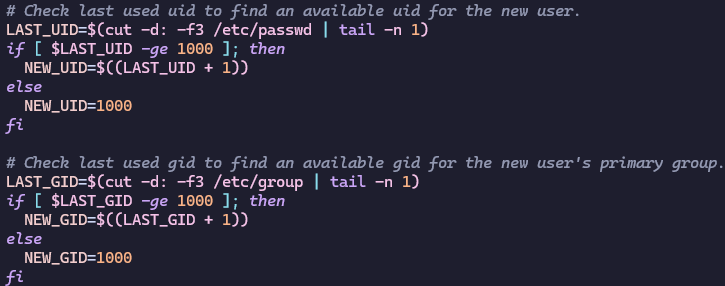
6. We assign the last user id and group id on the system to variables.
7. We check to see if each are greater than or equal to 1000, if they are then we can simply increment by 1 to set a new user id and group id that have not yet been used. If they are not greater than or equal to 1000, we can set this user to user id 1000 and group id 1000.

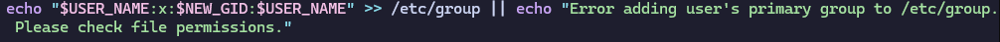
8. We append the /etc/group file with what will be the primary group for the new user. Using the username for the group name, setting the group id, and adding the user to the group. If the command fails we return an error message to the user.

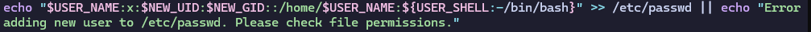
9. We append the /etc/passwd file to create the new user. Setting the username, user id, primary group id, shell (custom if specified, otherwise defaulting to bin/bash). If the command fails we return an error message to the user.

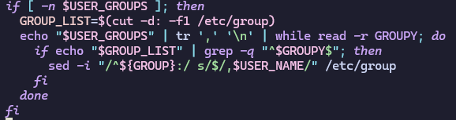
10. We check to see if the script has been given an argument for groups to add the user to. (-n flag specifies the variable is not empty)
11. If so, we create a variable holding all existing group names. We pipe this forward and use tr to replace commas with new lines, separating the list of groups into individual groups. We pipe this to the while read loop which can iterate over each line (each group) and assign to variable GROUPY.
12. We check the group list with grep for exact matches (-q flag to suppress output). 
13. For the group we've matched we find the users after the colon at the end of the line and assign them to a variable.
14. If we found any current users in the group we add a comma before adding the name of the new user, otherwise we just add the name of the user directly. For these operations we use sed (-i flag to edit in place) to perform substitution and add the user to end of the line.

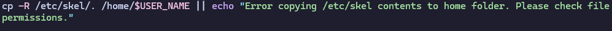
15. We copy the /etc/skel/. contents (-R flag to move all contents recursively) to the home directory of the new user. If the command fails we return an error message.

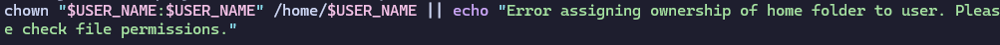
16. We use chown to give ownership of the user's home directory to the user we created. If the command fials we return an error message.