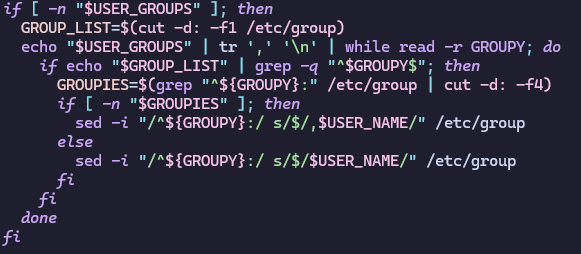

# 2420-assignment-2

# create-install
* 

1. Ensure script is run with sudo or by root. Check if id of user running script is not equal to 0. If so, this indicates the script was not run with sudo or by the root user, so we return an error message and exit the script.

2. Sync, refresh, and update current packages. Using --noconfirm so that user does not need to enter input to confirm installation.

3. Iterate through packages file and install each package name listed. Using --needed so that it only installs if it isn't already installed. No user confirmation required.

# create-links

1. Ensure script is run with sudo or by root. Check if id of user running script is not equal to 0. If so, this indicates the script was not run with sudo or by the root user, so we return an error message and exit the script.

2. $SUDO_USER is a variable set by sudo containing the user that used the sudo command. We can match this user in /etc/passwd with getent and then cut the user's home directory to set it to a variable.

3. If the sudo user variable is empty we can assume the script was run as root and we configure directories appropriately using ~/ (could also use /root)
4. If the sudo user variable is NOT empty we can assume the script was run with sudo and we configure directories appropriately using the variable we created in step 1.
5. We force delete any existing .dotfiles directory and any files/folders within it so that our clone can procede.
6. We clone the git repository into desired location, if the command fails we give the user an error message asking them to check specific git issues.
7. We force create the desired symbolic links, overwriting any current files of the same name. 

# create-main

1. Ensure script is run with sudo or by root. Check if id of user running script is not equal to 0. If so, this indicates the script was not run with sudo or by the root user, so we return an error message and exit the script.

2. We use getopts to allow the person runing the script to specify whether they want to run the installation script, the clone and link creation script, or both. The -a flag sets INSTALL variable to true, -b flag sets LINKS variable to true, any other flag returns an error message to the user and exits the script.

3. If installation variable has been set to true we run create-install script. If this command fails we return an error message asking user to ensure the required script exists in the necessary directory and then exits the script.

4. If links variable has been set to true we run create-links script. If this command fials we return an error message asking user to ensure the required script exists in the necessary directory and then exits the script.

# create-user

