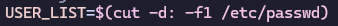

# 2420-assignment-2

# create-install
* 

1. Check if id of user running script is not equal to 0. If so, this indicates the script was not run with sudo or by the root user, so we return an error message and exit the script.

2. Sync, refresh, and update current packages. Using --noconfirm so that user does not need to enter input to confirm installation.

3. Iterate through packages file and install each package name listed. Using --needed so that it only installs if it isn't already installed. No user confirmation required.

# create-links

1. $SUDO_USER is a variable set by sudo containing the user that used the sudo command. We can match this user in /etc/passwd with getent and then cut the user's home directory to set it to a variable.

2. If the sudo user variable is empty we can assume the script was run as root, and so we clone the git repository and create symbolic links using ~/ to match the home directory (could also just write /root).
3. If the sudo user variable is NOT empty, we know the script was run with sudo and we clone the git repository and create symbolic links using the home directory variable we created in step one ($YOUR_HOME).
* If the git clone command fails we give the user an error message referring to what may have caused the error, and exit the script.
* We use the -f flag on symbolic link creation to force overwrites if those files already exist.

# create-main

# create-user

